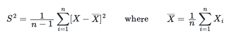
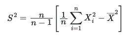

# Calculating the sample variance

If we do not know the exact value of the expectation for the distribution we should use the following estimator for the sample variance:

which we can easily rearrange to:

__Your task in this exercise is to write a function called `variance` that calculates an estimate of this quantity.__  This function should take in a single number `n`.  Within the function you should then generate `n` uniform 
random variables that all lie between 0 and 1.  From these `n` random variables you should then calculate an estimate for the variance of the underlying distribution using the second of the two expressions above.  
